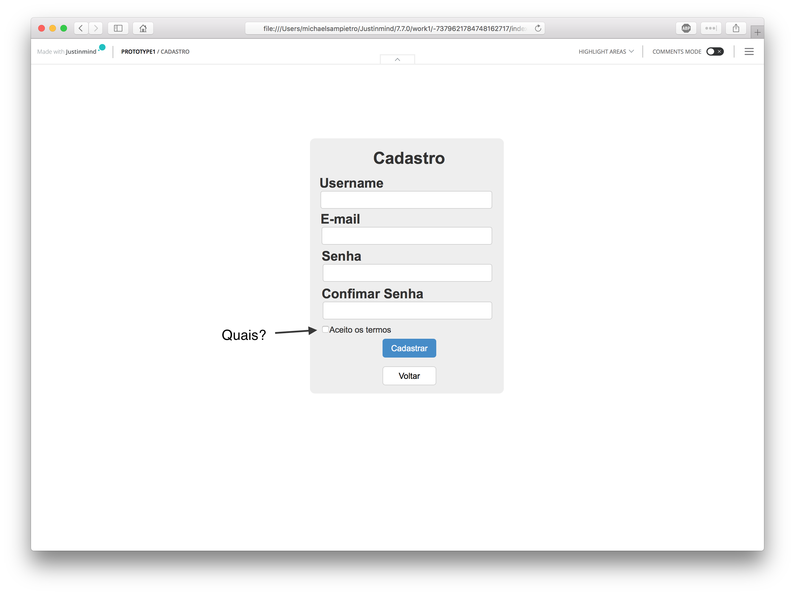
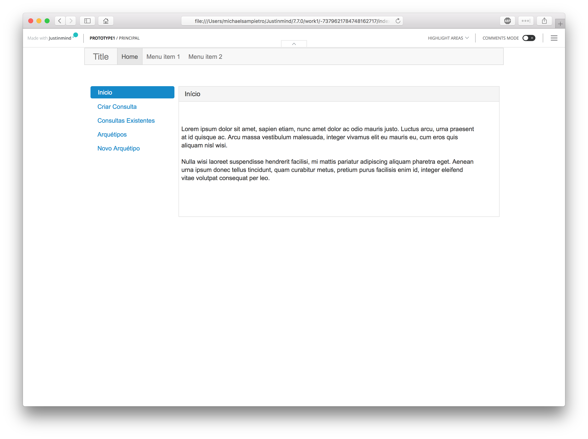
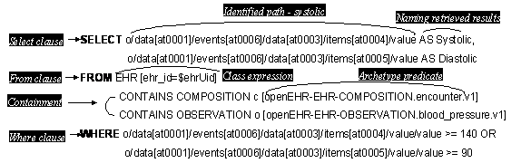
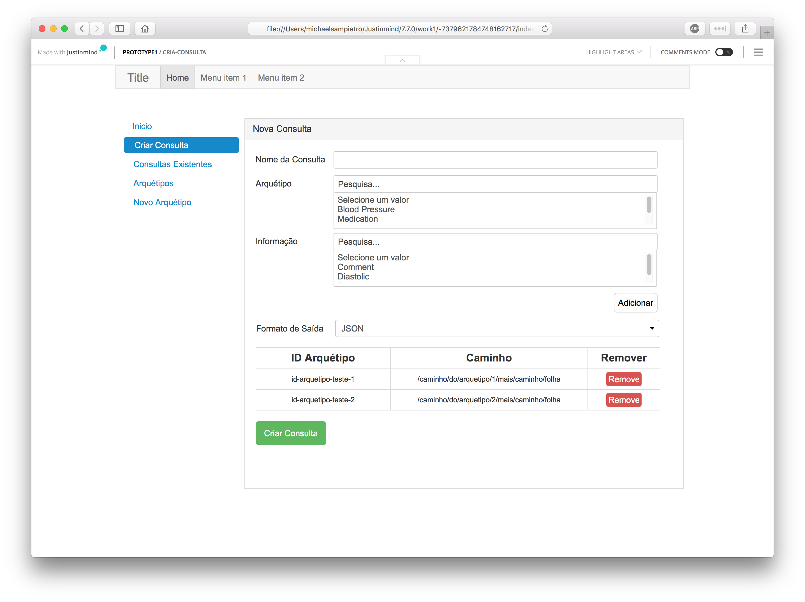
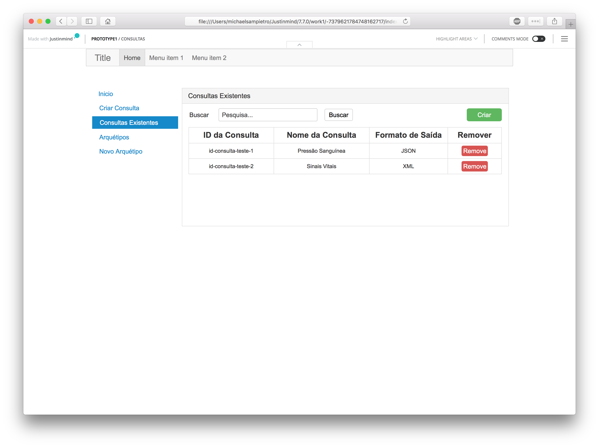
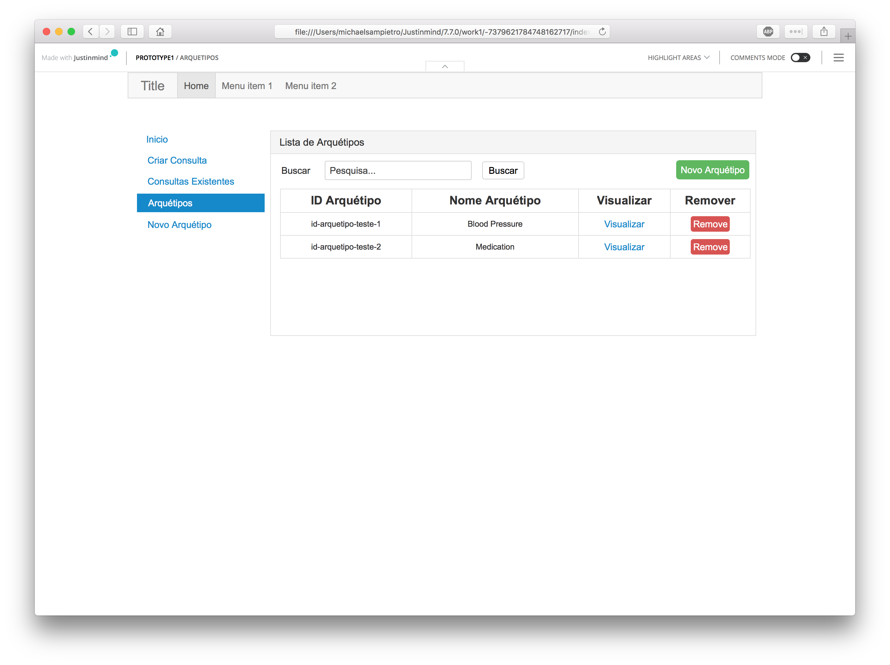
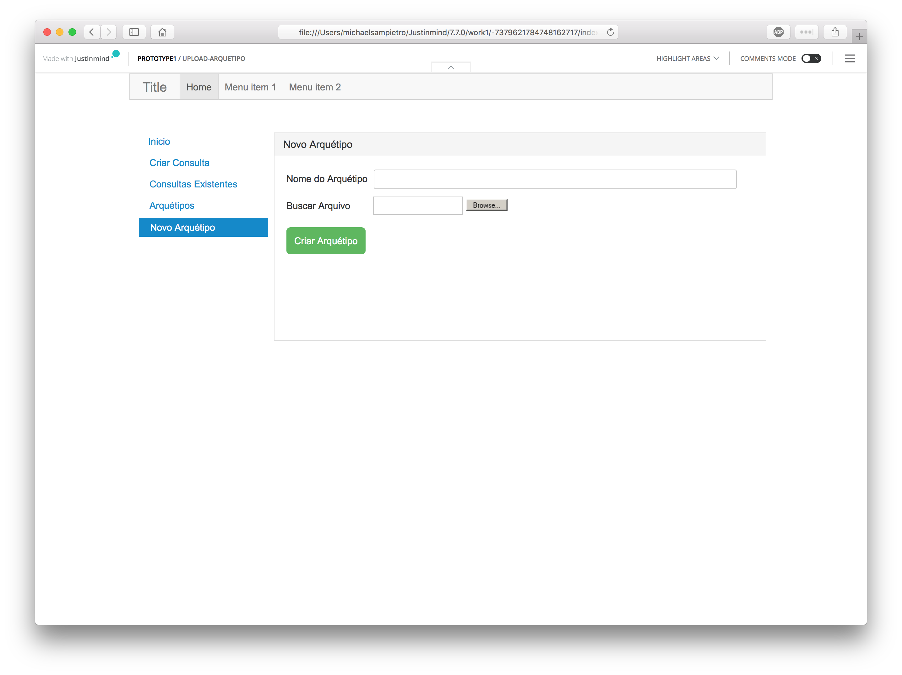

# Cadastro de usuário

- Não fica claro quais são os termos. Nesse caso, não se trata do texto propriamente dito, mas onde estariam disponíveis ou seriam exibidos?

# Principal

- Onde estaria a opção de cadastro, tela anterior?
- Onde está Title seria a logomarca do HealthDB?
- Também seria preciso uma opção para a língua (e não apenas português).

# Consulta
- Provavelmente o aspecto mais elaborado do projeto de interação. Veja a [apresentação](https://www.slideshare.net/borutf/querying-ehr-data-with-archetype-query-language) para um exemplo alternativo.
- Está faltando a possibilidade do próprio operador fornecer a consulta, manualmente. 
- Observe a consulta clássica extraída da especificação da AQL. Podemos nos basear nessa consulta na sua tela proposta para avançarmos. 

# Consultas existentes
- Não deveria ter uma opção para executar a consulta (além de remover)?
- Não deveria ter uma opção para editar a consulta? Por exemplo, ao clicar na consulta?

# Arquétipos
- Seria oportuno exibir um contador do total de arquétipos disponíveis (já acrescentados).
- Acredito que "Acrescentar" é melhor que "Novo" (ou seja, "Acrescentar arquétipo" como rótulo do botão).

# Acrescentar arquétipo
- Um arquétipo é um arquivo que pode estar disponível no computador local, mas também em um servidor externo, acessível por meio de uma URL, por exemplo, arquétipos do CKM. Ou seja, deve ser oferecida a possibilidade de se fornecer uma URL.
- Não entendi o nome, pois todo arquétipo possui um nome bem definido e, portanto, basta localizar o arquivo correspondente para obter o nome. 

