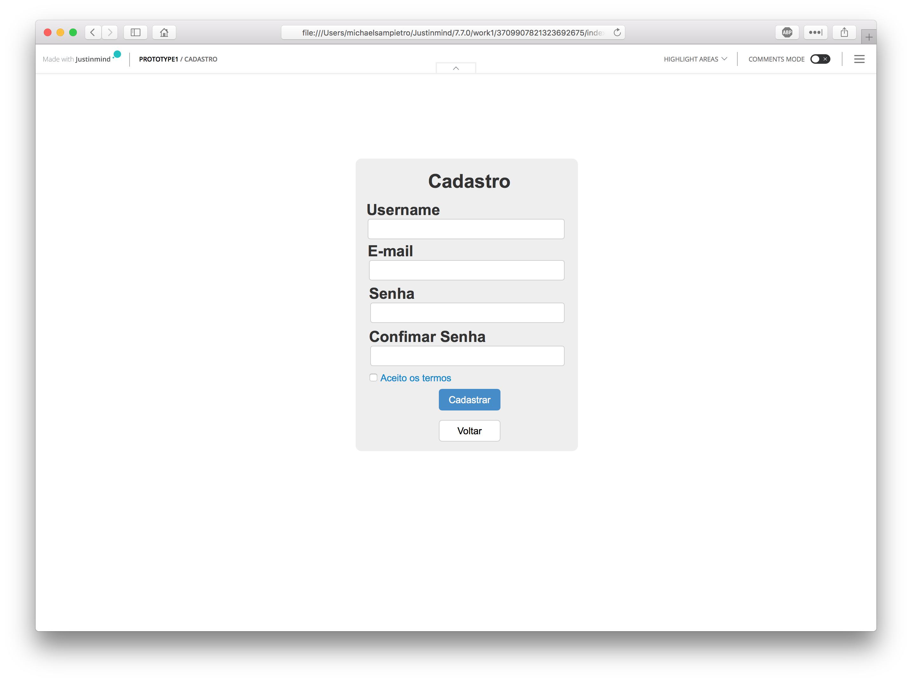
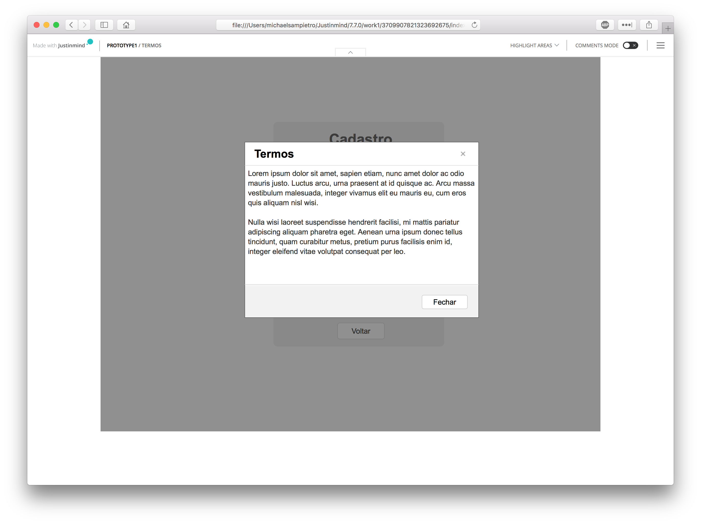
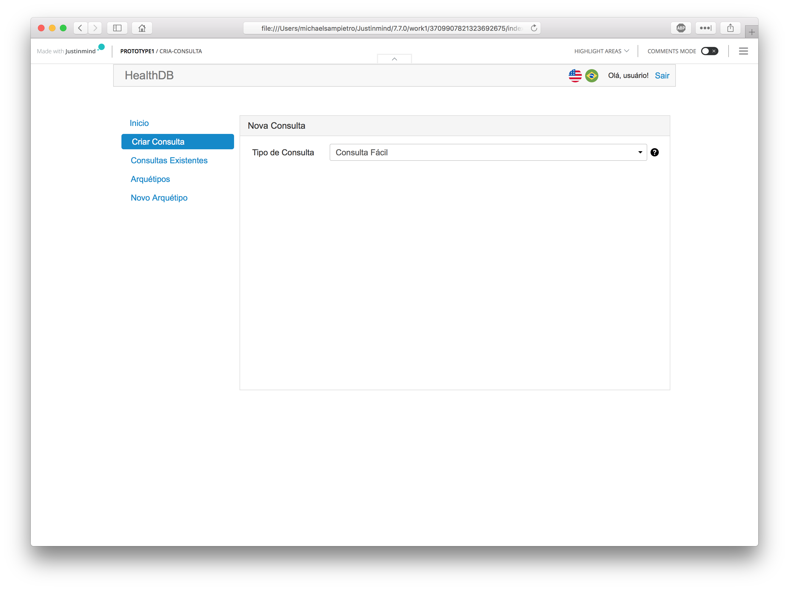
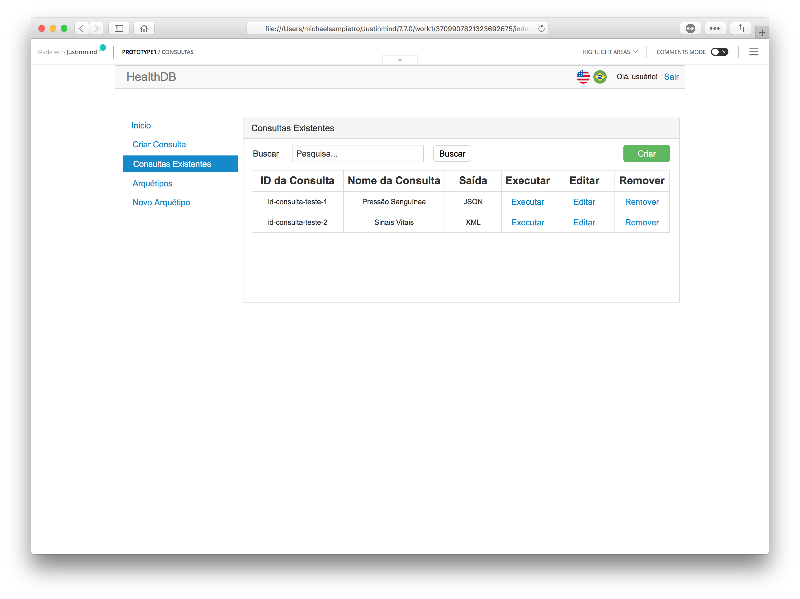
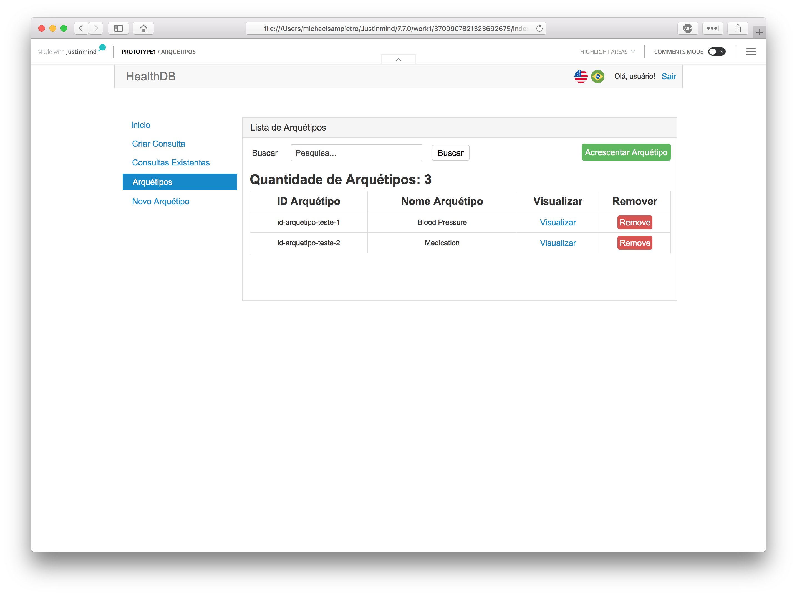

# Acerca de imagens
Todas as imagens utilizadas devem fazer uso de licença pública. Ou seja, já precisamos da licença dos ícones correspondentes às bandeiras (da barra) e seguramente de onde as obtemos. Isso também vale para a sugestão de ícones para operações, fornecida abaixo.

# Login
- Dado que essa é a tela inicial, sugiro que acrescente o nome do produto (HealthDB) na página. Caso contrário, nem sabemos exatamente onde estamos nos autenticando. Não deveria ser a mesma barra, aquela com as opções de língua?

# Cadastro de usuário

# Termos de cadastro

# Principal

# Consulta

# Consulta fácil
- Não seria "Salvar consulta" em vez de "Criar"?

# Consulta fornecida manualmente

- Em vez de testar não seria executar? Afinal, o que seria testar?

# Consultas
- Acredito que é melhor ícones para representar Executar, Editar e Remover. Ao passar o cursor sobre cada um deles a operação correspondente é exibida.

# Arquétipos disponíveis
- O identificador de um arquétipo é relativamente extenso, sugiro que use exemplos do CKM como openEHR-EHR-ACTION.imaging_exam.v0.
- Em vez de 'nome', o melhor é 'Conceito'. Por exemplo, para o arquétipo identificado acima o Conceito é 'Imaging examination'. 
- Rótulos da tabela seriam 'Identificador', 'Conceito' e 'Operação' (novamente representada não pelo texto, mas por ícone correspondente à visualização e outro para remoção. Ou seja, apenas 3 colunas.
- Essa lista é extensa, ou seja, deve possuir barra de rolagem, esse é o cenário mais comum. 
- No item acima há uma complicação adicional, pois o conceito pode ser fornecido em vários idiomas em um arquétipo, ou seja, "deveria" ser "Exame de imagem" se houvesse versão em português. Como não há, ficaria o valor em Inglês (por padrão). 

# Acréscimo de arquétipo
- Em vez de usar 'Novo Arquétipo' com a inicial maiúscula em Arquétipo, melhor seria apenas a primeira letra maiúscula e todos os demais em minúscula. Essa observação vale para as demais telas e todos os itens, por exemplo, melhor seria "Buscar arquétipo".

