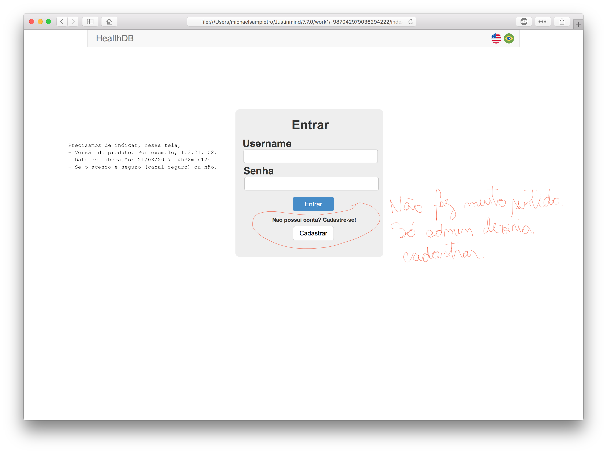
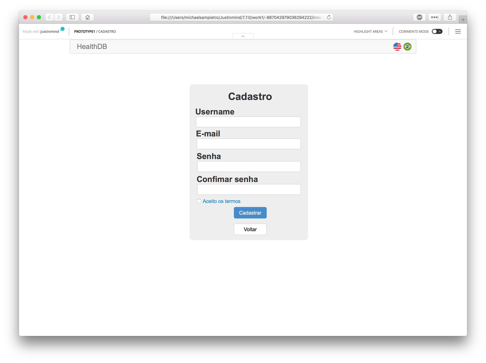
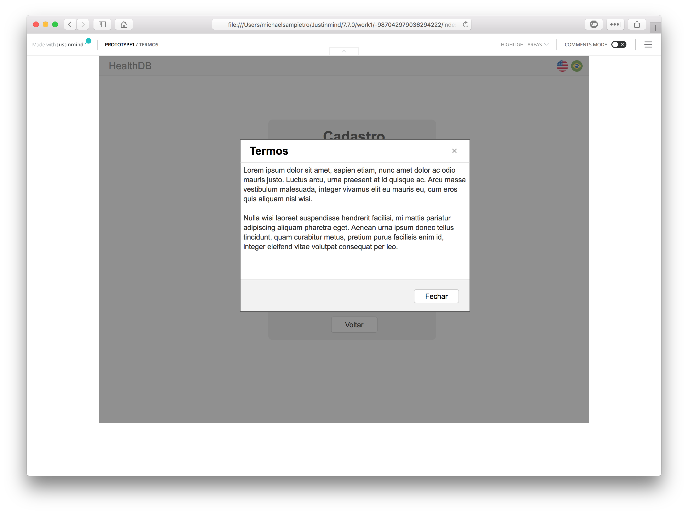
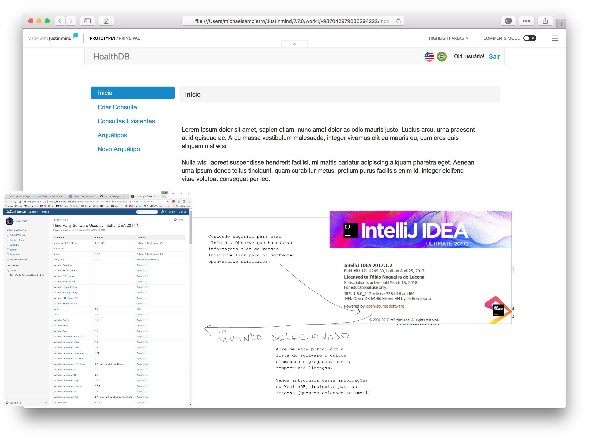
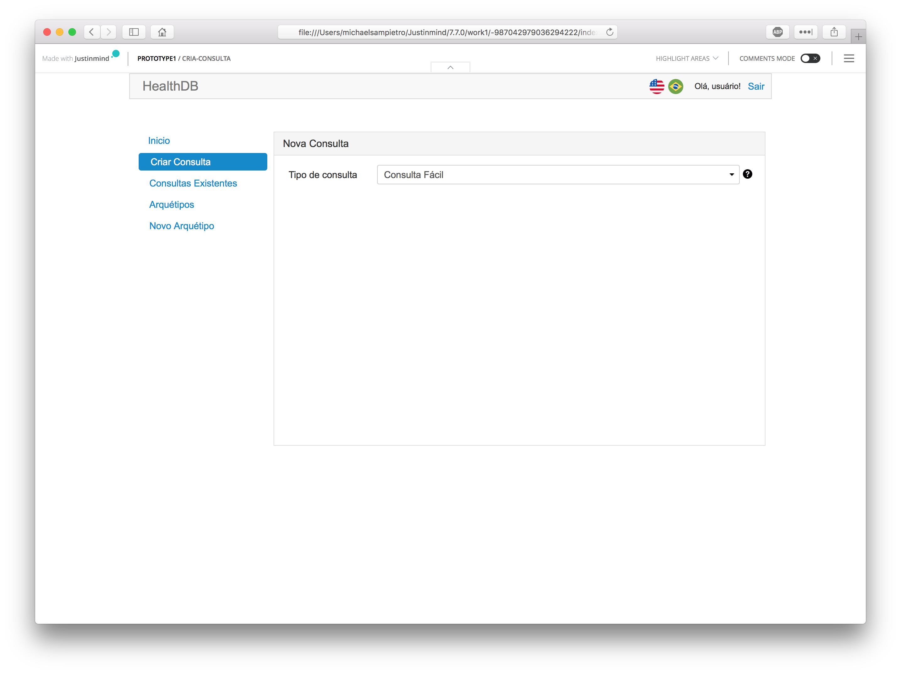
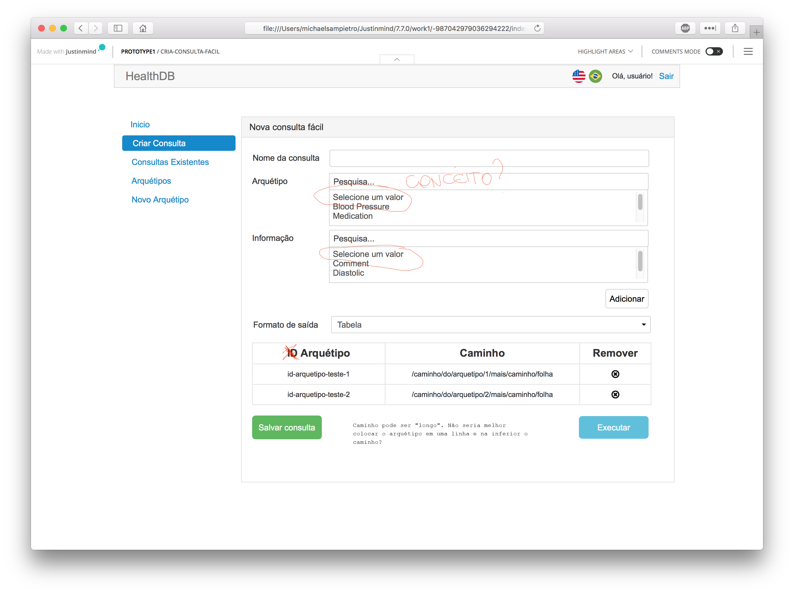
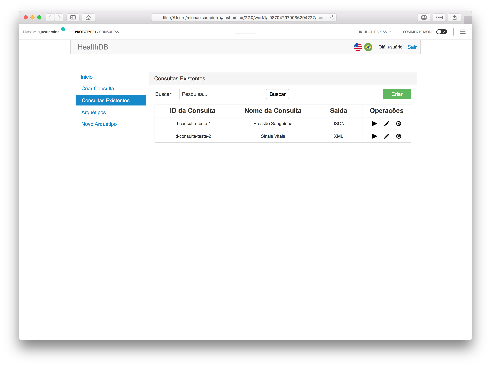
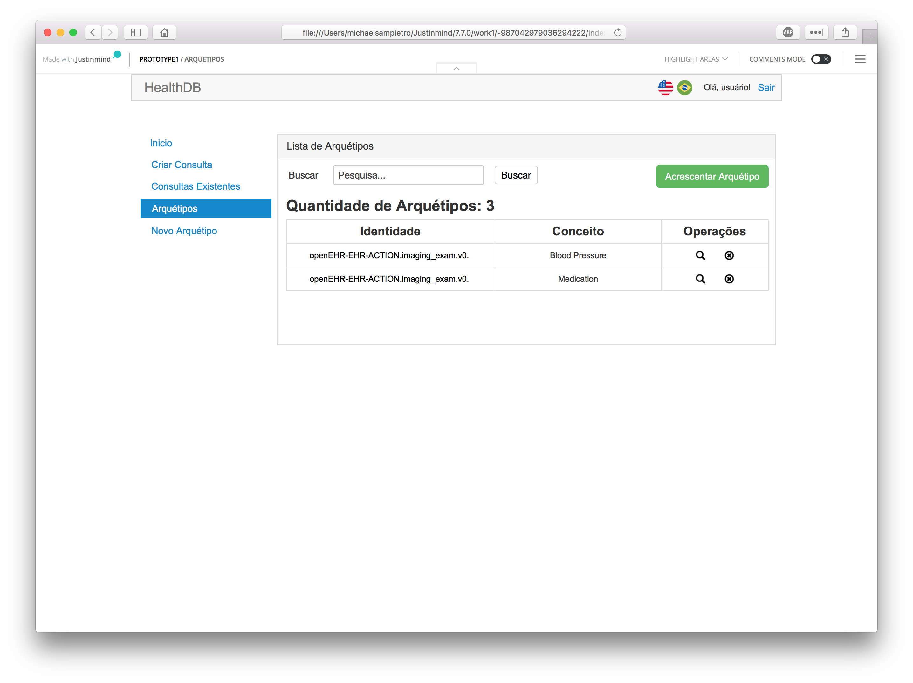

# Acerca de imagens
Todas as imagens utilizadas devem fazer uso de licença pública. Ou seja, já precisamos da licença dos ícones correspondentes às bandeiras (da barra) e seguramente de onde as obtemos. Isso também vale para a sugestão de ícones para operações, fornecida abaixo.

# Login
- Dado que essa é a tela inicial, sugiro que acrescente o nome do produto (HealthDB) na página. Caso contrário, nem sabemos exatamente onde estamos nos autenticando. Não deveria ser a mesma barra, aquela com as opções de língua?

# Cadastro de usuário

# Termos de cadastro

# Principal

# Consulta

# Consulta fácil

# Consulta fornecida manualmente

# Consultas

# Arquétipos disponíveis

# Acréscimo de arquétipo

